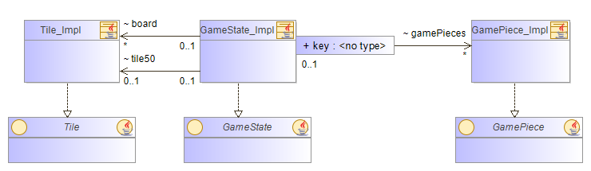
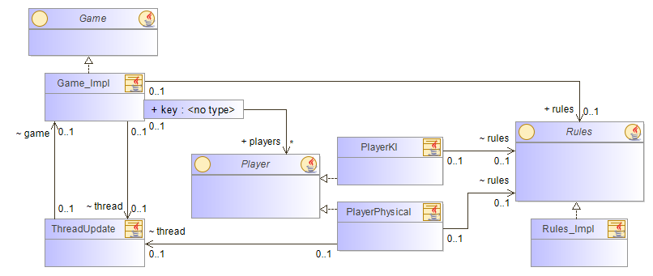
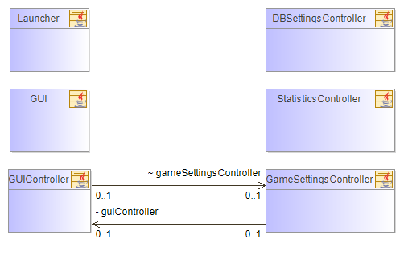
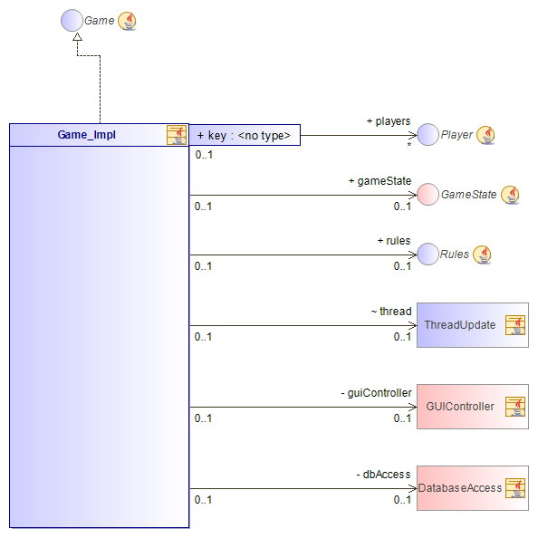
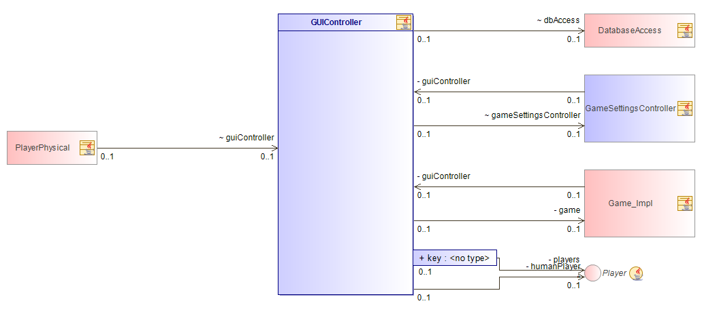
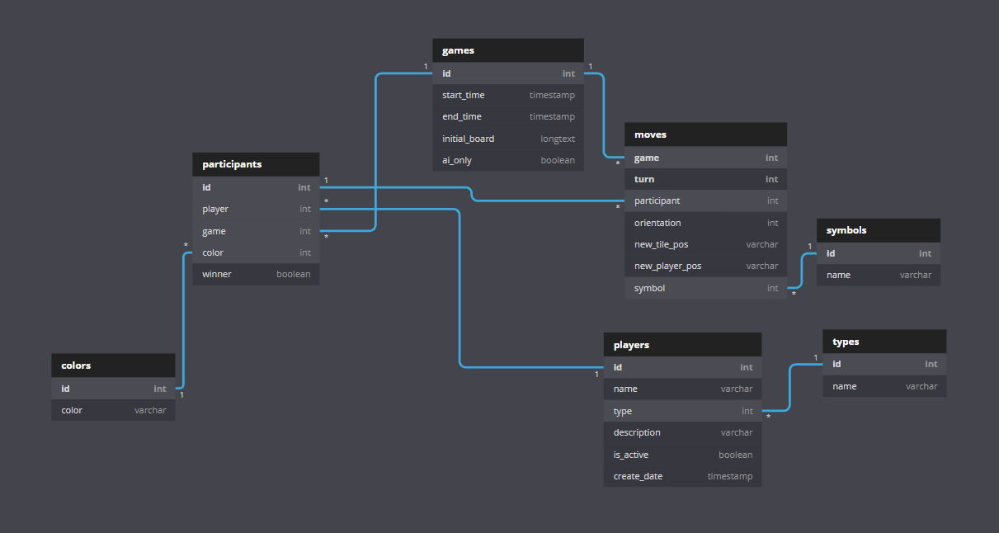

# Labyrinth
## Summary
This was a three man project in university. The topic and requirements were made by the professor, collaborators were randomly assigned. The project is a singleplayer/AI-only implementation of the board game [Labyrinth](https://en.wikipedia.org/wiki/Labyrinth_(board_game)). The purpose of this project was to get experience in working with people that the students did not choose themselfs as well as applying previously learned documentation skills. It focuses mainly on providing an interface for interested developers to implement their own AIs into the game and evaluate which is the most efficient.

Note: Parts of the jdoc documentation and in-code-comments are not in english, but in geman language. These were created by a non-english speaking collaborator of the project.

#### Features
* CLI to simulate a high number of games with 2-4 AI participants
* Database access to save the results (and every move) of games
* GUI to evaluate database data of AI and/or player games
* GUI for users to play the game in singleplayer mode against 1-3 AIs
#### Tools and libraries
* Apache Maven
* JavaFX
* JDBC Driver for MySQL

## User
### Getting started

First, use git clone or zip-download to get all data needed. Be sure to have JDKv14 or compatible installed.

To use the maven-build-tool you need to have maven and jdk in your PATH.

Navigate to folder with the `pom.xml` and to just run it in JavaFX-based graphics mode type `mvn [clean] javafx:run`, to build a runnable (and shaded) fat-jar run `mvn [clean] package`. On first run of one of these commands a download of dependencies will start, so be sure to allow it for maven in your firewall!

The fat jar will be named according to information in `pom.xml`, we'll assume it's called `laby-shaded.jar`.

To store data of game results and the history of moves made during a game a SQL server needs to be set up. 
You can download the current version of the MySQL Community Server for your operating system at: https://dev.mysql.com/downloads/mysql/ 

Please make sure the user you create for your server connection has sufficient rights to create, drop and alter databases, tables and views.
In case you should use an already existing server please make sure to use a seperate database for this application to avoid losing data when resetting the database. 

### Work with GUI
#### Play the game as a human Player

To start GUI by CLI type `java -jar path\to\laby-shaded.jar`. If file type extension jar is correctly registered on your system you can also try to double-click in your file browser.

To start a new game call 'Game' > 'Configure New Game' and follow the instructions:

- choose colors in game by clicking on colored circles (at least two players are needed!)
- choose which color should be the human player (and choose your name)
- choose your opponent (if there is more than one option in dropdown)
- start your game

Your settings will not be stored! Every game played to end will be written to database!

#### Configure Database-Settings by GUI

Call 'Game' > 'Database Settings' and fill in your credentials for a MySQL-compatible database, check your connection and save after test was successful.

#### Configure Visual Settings in GUI

Menu-Toggle 'Show visible help' gives a human player visible help by highlighting tiles in range when gamepiece has to move.

Menu-RadioItem 'Delay' allows you to switch between a fast, medium and slow game speed. This setting effects only AI moves (move of tile and of gamepiece).

### Work with CLI

#### Run simulations by CLI

To run simulations (i. e. to generate data for a neural network) you can use the CLI. You need to have at least two players in your game settings and you have to give a number of games to simulate.

    -red [AI-Name]      red player
	-blue [AI-Name]     blue player
	-green [AI-Name]    green player
	-yellow [AI-Name]   yellow player
	-number LONG        number of games to simulate      
	-thread INT         number of threads to use for simulation
	
The `[AI-Name]` needs to be exactly the same as in one of the cases in '`Player.createPlayer(className, color)` in Player-Interface. Colors not in game must not be mentioned in params!

#### Configure Database-Settings by CLI

You can set database-settings by GUI or CLI, both will use the same credentials. To set it by CLI call

    java -jar laby-shaded.jar -db -host [IP-Adress] -port [Port-Number] -dbname [Database-Name] -user [Database-User] -pwd [Password]
	
#### Reset Database by CLI

You can set reset the database by GUI or CLI. This will completely drop the database and recreate it from scratch with all needed tables, views and initial data.
To reset it by CLI call

    java -jar laby-shaded.jar -dbreset
    
Afterwards you have to confirm the database reset by pressing y or Y.

## Developer

This is a JavaFX project working widely with .fxml-files for describing GUI.

### Getting started

To start development you can follow these instructions:

1. Install JDKv14 or compatible, add the `\bin`-folder to your PATH
2. Install maven, add the `\bin`-folder to your PATH
3. Install IntelliJ with maven-plugin (or any other IDE)
4. Use git clone or zip-download (and extract it) to get a working dir
5. Import folder as new project in IntelliJ, wait for prompt to import maven-settings.
6. Set your JDK in IntelliJ-project.
7. Run Launcher.main() in view-package as new configuration.
8. Have fun to contribute.
9. To build fat-jar run `mvn clean package` from within your project folder (which must contain the `pom.xml`-file).

### Add a new AI

To add a new AI generate a new class in package logic that implements the Player Interface. All methods that are mentioned in the java-doc have to be implemented accordingly!
This class must be registered at two points:

- Inside the static `createNewPlayer`-method inside the Player Interface: Add another switch-statement for your new class, remember your STRING
- If you'd like to be able to set this new AI inside the GUI add a line to the list at the beginning of `initialize()`-method in GameSettingsController

### Get an overview of this project by some diagrams

This project consists of four packages:

- `logic` for game logic and computer-players
- `model` general data for game-modelling
- `database` for connection to SQL-Database
- `view` contains launcher-class, CLI and GUI

#### The MODEL package

#### The LOGIC package

#### The VIEW package

#### Some Class Structures to show intersections between packages

At first the game implementation to show how a game works.

Second the GUIController which works for gui-standard.fxml and works on the Application main window.

### Database information

The database consists of seven tables, one view and initial data in the tables colors, types and symbols. On resetting the database all tables, the view and intitial data will be generated automatically. 

#### Diagram of the ERM

In addition to the tables above the database holds a view 'max_turn' which has two columns 'game' and 'turn'. The first shows the id of all games in the database while 'turn' shows how many turns it took to finish the game.

There are two columns that contain non-atomic values:

- games.initial_board: Contains the random distribution of tiles at the start of the game and also the lose tile, which has to be inserted in the first turn by a player, as a text.
- moves.new_player_pos: Since the active player can move up to four gamepieces by inserting a tile this column contains information of the new position of each color after a turn has finished. 

For further information on how exactly those values are build and formatted see the developer manual.

### Other information
#### Run from IDE for a configuration not as a maven-project
Set VM options to `--add-modules javafx.controls,javafx.fxml --add-exports javafx.graphics/com.sun.javafx.sg.prism=ALL-UNNAMED`
